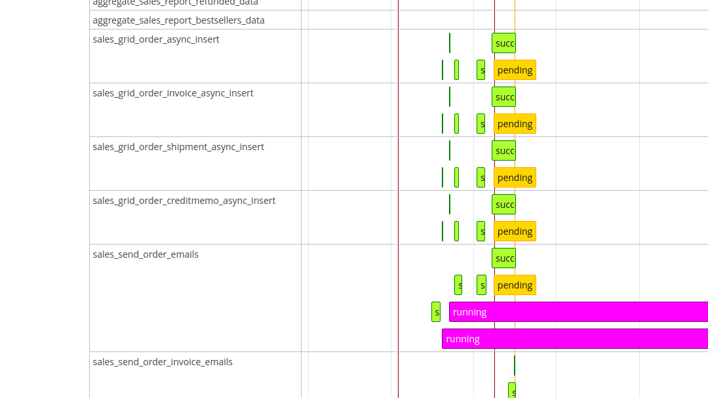

# magento2-module-cron-schedule

A visual cronjob overview for magento2 backend



## Installation

Add the module to your composer file.

```json
{
  "require": {
    "shockwavemk/magento2-module-cron-schedule": "dev-master"
  }
}

```

Install the module with composer.

```bash

    composer update

```

On succeed, install the module via bin/magento console.

```bash

    bin/magento cache:clean

    bin/magento module:install Shockwavemk_CronSchedule

    bin/magento setup:upgrade

```


## Features

Shows a new Adminhtml menu entry System > Cronjob > View Cronjob Configuration.
